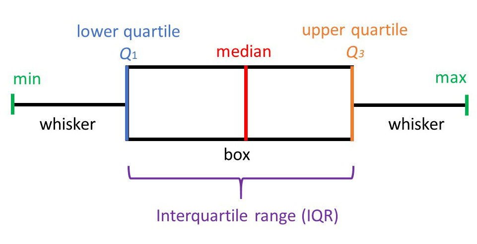

Run by: `r Sys.getenv("USER")` 

report version v 0.2


<!-- 

draft of pipeline report
to be used with pipeline_report.v0.1.R

6i2023

title: shRNA screen report <br> Project `#r# proj.name.pref`

 -->


----------------

```{r, echo=FALSE}
htmltools::img(src = knitr::image_uri(file.path("logos", "nbislogo-blue-txt.png")), 
               alt = 'NBISlogo', 
               style = 'position:absolute; top:0; right:0; padding:10px; width: 13vw')
```


```{r include=FALSE,cache=FALSE}
library(knitr)
library(bookdown)


knitr::opts_chunk$set(echo = FALSE,
                      cache = FALSE,
                      collapse = TRUE, 
                      warning = FALSE, 
                      message = FALSE)


script_pth="./screen_report.v0.1.R"
knitr::read_chunk(script_pth)

source("./shRNA_screen_report_functions.R")
```


```{r dirs, include=FALSE,cache=FALSE}

```


```{r prep_environment, include=FALSE,cache=FALSE}

```


*Schematics with explanation of some plots can be found in the Appendix.*


This report was generated based on the following parameters:

* project directory: `r proj.dir`

* project name: `r proj.name.pref`

* data directory (processing pipeline output): `r data.dir`

* metadata directory: `r metadata.dir`

* library annotation: `r library`

* results of RRA snalysis by MAGeCK: `r mageck.dir`

* mageck analysis mode: `r setup`


# Contents

1. Materials and Methods
2. Results
5. Comments
6. Deliverables
7. References
8. Appendix

<br />
<br />


# Materials and Methods <a name="Materials-and-Methods"></a>


## Data Processing
## Data Processing

* Data has been processed using shRNAseq pipeline installed from [shRNAscreen github repository](https://github.com/agata-sm/6257_shRNAscreen).


* Analysis of screen results was performed uing Robust Rank Aggregation test (`rra`) from `MAGeCK` version 0.5.9.4 [@mageck]; counts were scaled to total counts in each library (`--norm-method total`)

  The command used to perform RRA test was (example for treated vs. control samples):

  ```
  mageck test -k $count_tabl -c OVCAR3-ct1,OVCAR3-ct2,OVCAR3-ct3 -t M37,M38,M39,M40,M41,M42 -n M37_42_vs_ctrl --norm-method total
  ```

  Three workflows were employed when processing count table for statistical analysis:

  1. All shRNAs were used in the analysis (for dispersion estimation and RRA), including shRNAs which had 0 counts in all samples;

  2. Only shRNAs with at least 1 count in *any* of the samples were used in the analysis (for dispersion estimation and RRA); subsequently, for testing of each contrasts shRNAs with 0 counts in samples pertaining to this contrast were not taken into account by using option `--remove-zero both`;

  3. In addidion to procedure (2), shRNAs with documented off-target effects were removed (i.e. shRNA clones with alternative locus listed in column 18  `refseqAltGeneSameSpecies` in files `SHPH01_LentiPlexHuman_1.0_pools_1-5` and `SHPH01_LentiPlexHuman_1.0_pools_6-10`.)

  As a consequence, three versions of the results and this associated report exist. They are denoted with file prefixes:

  1. `all`

  2. `0rm`

  3. `0rm_noAlt`

<br />

This report has been generated using setup **`r setup`**.

<br />

* Replicate consistency on the counts level (PCA, Spearman clustering) was assesed on read counts normalised by the trimmed mean of M-values (TMM) method [@TMM].

* Statistical analyses, plotting and report generation were perfomed in `R` [@R-base]; Please refer to "Session Info" for details on package versions.


<br />
<br />


# Results <a name="Results"></a>


## Library Summary Statistics <a name="sumstat"></a>


Plots for library statistics and summary of quantification of shRNA levels. These are diagnostic plots which help to evaluate the read processing of the libraries in the screen and may help to flag potentially low quality libraries. 


Summary of read processing and assignment to shRNAs in all libraries is presented on Figure \@ref(fig:map-stats-plot) and in Table \@ref(tab:data-mapstats-table).


```{r data_mapstats, include = FALSE}

```


```{r map-stats-plot, include=TRUE, fig.show='show', fig.cap="Number of read pairs assigned to shRNAs. Numbers inside bars indicate the fraction of read pairs assigned to shRNAs."}

```

```{r map-stats-plot-save, include = FALSE}

```
This plot is saved as **`r fname`**.


<br />

```{r data-mapstats-table, echo=FALSE ,results='asis'}

```


<br />


<br />

## shRNA coverage

This is count table part.

```{r count-table, include = FALSE}

```


Read pairs mapped to shRNAs after alignment filtering are summarised in Table \@ref(tab:shRNA-stats-table). Expressed shRNAs are shRNAs with at least 1 assigned alignment.
The Gini index is a measure of inequality or diversity. It is zero if all the values of x are equal; the values are between 0 in the case of perfect equality and 1 in the case of perfect inequality.


```{r shRNA-stats, message=TRUE, warning=TRUE, include=FALSE}
```


total shRNA clones in the library: **`r total_shRNA_library`**

total shRNA clones in the analysis: **`r total_shRNA`** (may be equal to all expressed shRNAs, if shRNAs with 0 counts across all samples were removed)

all expressed shRNA (shRNA with at least 1 assigned alignment in *any* library): **`r total_expr_shRNA`**


```{r shRNA-stats-table, echo=FALSE ,results='asis'}

```

<br />


```{r shRNAboxplot, message=TRUE, warning=TRUE, include=FALSE}

```


```{r shRNA-stats-plot, include=TRUE, fig.show='show', fig.cap="Boxplot of number of filtered alignments per shRNA."}

```


<br />

<!-- 
This is the histogram of shRNA coverage with alignments.

 -->


```{r hist-reads-shRNA, message=TRUE, warning=TRUE, include=FALSE}
```

The box plot presents distribution of read counts per shRNA (Figure \@ref(fig:shRNA-stats-plot) ). The same information is presented on a histogram (Figure \@ref(fig:hist-reads-shRNA-plot)). The axes of the histograms are capped (X axes `r x_lim` and the Y axes at `r y_lim`) to focus on the region of most diversity in reported read counts per shRNA.


```{r hist-reads-shRNA-plot, include=TRUE, fig.show='show', fig.cap="Histogram of number of read pairs per shRNA. X and Y scales are capped to avoid domination of shRNAs with very high counts."}

```

Please note that the X axes of these plots is capped at `r x_lim` and the Y axes at `r y_lim`. 


<br />

To asses the sparsity of the data, the summary of number of genes with counts reported in combination of samples and conditions is presented on Figure \@ref(fig:exprs-venn). 
This analysis was performed at a gene level (i.e. counts to all shRNAs targeting given gene were summarised together), to exclude any shRNA-specific biases in individual samples. To mark gene as expressed in given experimental condition, presence of 1 count in at least 2 samples within this condition was required. Genes with shRNA signal common between experimental groups are depicted on Figure \@ref(fig:exprs-venn).


```{r expr_overlap_cond, message=TRUE, warning=TRUE, include=FALSE}
```

```{r exprs-venn, include=TRUE, fig.show='show', fig.cap="Venn diagram depicting overlap of gene represented within each condition."}

```


<br />
<br />

## Statistical Analysis of shRNA Abundance <a name="mageck"></a>


MAGeCK is a tool designed to identify positively and negatively selected sh/sgRNAs and genes in genome scale knockout experiments. It encompasses four steps: read count normalization, mean-variance modeling, sgRNA ranking and gene ranking [@mageck].

sh/sgRNAs are ranked based on P-values calculated from the negative binomial model, and a modified robust ranking aggregation (α-RRA) algorithm is used to identify positively or negatively selected genes. More specifically, α-RRA assumes that if a gene has no effect on selection, then sh/sgRNAs targeting this gene should be uniformly distributed across the ranked list of all the sh/sgRNAs. α-RRA ranks genes by comparing the skew in rankings to the uniform null model, and prioritizes genes whose sh/sgRNA rankings are consistently higher than expected. α-RRA calculates the statistical significance of the skew by permutation.

The results are the sh/sgRNA summary (`sgrna_summary.txt`) and gene summary files (`gene_summary.txt`) for each of the comparisons. These files contain the summaries of the the statistical significance of positive selections and negative selections at sh/sgRNA level and gene level. Formats of these files are described in more detail in section [Deliverables](#deliv). 

<br />
<br />

Comparisons analysed in this section are summarised in Table \@ref(tab:contrasts-table).


```{r read-contrasts, include=FALSE,cache=FALSE}
```

```{r contrasts-table, echo=FALSE ,results='asis'}

```


```{r collect-rra-res, include=FALSE,cache=FALSE}
```

```{r echo=FALSE, results='asis'}
options(knitr.duplicate.label = "allow")
res <- vector(mode = "list", length = n.cont)

for (i in my.contrasts) {
    res[[i]] <- knitr::knit_child("report_rra.Rmd", quiet = TRUE, envir = environment())
}

cat(unlist(res), sep = '\n')
```

<br />
<br />
<br />


<br />
<br />
<br />


## Replicate Concordance <a name="RepCon"></a> {.tabset}


Replicate concordance can be adressed using several methods probing different properties of data.


### PCA <a name="PCA"></a>


Principal Component Analysis (PCA) is a technique to summarize and to visualize the information in a data set containing observations described by multiple inter-correlated quantitative variable. PCA is used to extract the important information from a multivariate data table and to express this information as a set of few new variables called principal components. These new variables correspond to a linear combination of the originals. The information in a given data set corresponds to the total variation it contains. The goal of PCA is to identify directions (or principal components) along which the variation in the data is maximal.
In other words, PCA reduces the dimensionality of a multivariate data to two or three principal components, that can be visualized graphically, with minimal loss of information.

PCA of TMM-normalised log2 read counts summarised to individual
shRNA (A) and gene (B) aims to assess similarities amongst the samples in the dataset. In some cases the counts
summarised by shRNA may yield unstable results due to uneven effect on individual guides targeting the same gene. To
overcome this, PCA was computed for counts summarised per gene (as sum of shRNA counts).


```{r pca_prep, echo=FALSE, include=FALSE}

```


```{r pca-plot, dev='png', echo=FALSE, fig.show='show',fig.dim=c(12, 6), cache=FALSE, fig.cap="PCA on read counts summarised per shRNA (A) and gene (B)."}

```


As all non-ctrl samples teneded to group toghtly together on the PCA plots containing all samples, to gain more insight into their differences, the control samples (i.e. OVCAR3-ctN) were removed from the PCA analysis.


```{r pca_no_ctrls, echo=FALSE, include=FALSE}

```


```{r pca-plot-noctrls, dev='png', echo=FALSE, fig.show='show',fig.dim=c(12, 6), cache=FALSE, fig.cap="PCA on read counts summarised per shRNA (A) and gene (B). Control samples were removed from the analysis."}

```

### Sample Correlation (Spearman) <a name="Corr"></a>


Another method for assesing the similarity between samples and to identify outliers is by comparing
pairwise sample correlations. Rank based Spearman correlation coefficients between all samples are plotted as heatmap.


```{r smpl_correlations, echo=FALSE, include=FALSE}

```


```{r smpl-correlations-gene, dev='png', echo=FALSE, fig.show='show',fig.dim=c(4, 4), cache=FALSE, fig.cap="Pairwise Spearman correlations between samples using log-normalised read counts summarised to genes."}

```


```{r smpl-correlations-sgRNA, dev='png', echo=FALSE, fig.show='show',fig.dim=c(4, 4), cache=FALSE, fig.cap="Pairwise Spearman correlations between samples using log-normalised read counts summarised to shRNAs."}

```


<br />
<br />
<br />


# Comments


# Deliverables <a name="Deliverables"></a> {#deliv}


## Tables

All tables included in this report are saved in files indicated throughout the text.

All tables are tab-delimited and can be open in a spreadsheet application (Excel, LibreOffice, Numbers). Please make sure to set the decimal to `.` when importing the tables to avoid content changes.

<!-- <br />
Two more complex file formats are described in detail below.
 -->

<br />

**Results of robust rank aggregation (RRA) analysis (MAGeCK) to identify enriched and depleted genes** in files `Table.N.RRA_mageck.reads.COMPARISON.tsv`. 
Each row corresponds to a targeted gene, all genes are shown.

Fields in the table:

* `id` gene id

* `description` of gene product

* `num` number of shRNA probes targeting the gene

* `score` RRA score by MAGeCK

* `p value` uncorrected p value from the RRA test

* `FDR` false discovery rate, i.e. p value adjusted for multiple comparisons

* `rank` position on a gene list ranked by the RRA score

* `goodsgRNA` number of shRNAs whose ranking is below the alpha cutoff (0 in this case)

* `lfc` gene log2(fold change)


Fields specific to **positive** selection are prefixed with `pos`.

Fields specific to **negative** selection are prefixed with `neg`.

Please also refer to [MAGeCK documentation](https://sourceforge.net/p/mageck/wiki/output/#gene_summary_txt) for format specification.


<!-- <br />
**Results of GSEA** in files `Table.N.GSEA.GO.COMPARISON.SELECTION.tsv` and `Table.N.GSEA.reactome.COMPARISON.SELECTION.tsv`. This is a table with GSEA results. Each row corresponds to a tested pathway, only pathways enriched above the significance threshold are shown.


* `ONTOLOGY` not available for reactome analysis

* `ID` of category (internal to database)

* `Description` of category gene set

* `setSize`  size of the gene set after removing genes not present in the data

* `enrichmentScore` GSEA enrichment score, same as in Broad GSEA implementation

* `NES` enrichment score normalized to mean enrichment of random samples of the same size

* `pvalue`  p value from the GSEA test, as implemented in R package `fgsea`

* `p.adjust` p value adjusted for multiple comparisons (FDR)

* `qvalues` the proportion of false positives incurred 

* `leading_edge` leading-edge subset in a gene set are those genes that appear in the ranked list at or before the point at which the running sum reaches its maximum deviation from zero; the leading-edge subset can be interpreted as the core that accounts for the gene set’s enrichment signal

* `core_enrichment` genes that contribute to the leading-edge subset within the gene set; this is the subset of genes that contributes most to the enrichment result for given pathway
 -->


<br />

## Plots

All plots included in this report are saved in files indicated throughout the text.


<br />
<br />
<br />

# SessionInfo

```{r}
sessionInfo()
#mySIprint(sessionInfo())
```


# References


# Appendix <a name="Appendix"></a>


This section offers explanations of several types of plots present in this report.


## Boxplot and Violin Plot




Boxplot is one of the simplest ways of representing a distribution of a continuous variable. It consists of two parts:

* Box — Extends from the first to the third quartile (Q1 to Q3) with a line in the middle that represents the median. The range of values between Q1 and Q3 is also known as an Interquartile range (IQR).

* Whiskers — Lines extending from both ends of the box indicate variability outside Q1 and Q3. The minimum/maximum whisker values are calculated as Q1/Q3 -/+ 1.5 * IQR. Everything outside is represented as an outlier.


Violin plot additionally shows the probability density of the data at different values, allowing for a better visualisation of data distribution.


source: [R-bloggers](https://www.r-bloggers.com/2021/11/how-to-make-stunning-boxplots-in-r-a-complete-guide-with-ggplot2/)

[image source](https://www.simplypsychology.org/boxplots.html)

<br />
<br />

<!-- 
## GSEA plot


The primary result of the gene set enrichment analysis is the enrichment score (ES), which reflects the degree to which a gene set is overrepresented at the top or bottom of a ranked list of genes. GSEA calculates the ES by walking down the ranked list of genes, increasing a running-sum statistic when a gene is in the gene set and decreasing it when it is not. The magnitude of the increment depends on the correlation of the gene with the phenotype. The ES is the maximum deviation from zero encountered in walking the list. A positive ES indicates gene set enrichment at the top of the ranked list; a negative ES indicates gene set enrichment at the bottom of the ranked list.

In the analysis results, the enrichment plot provides a graphical view of the enrichment score for a gene set:


* The top portion of the plot shows the running ES for the gene set as the analysis walks down the ranked list. The score at the peak of the plot (the score furthest from 0.0) is the ES for the gene set. Gene sets with a distinct peak at the beginning (such as the one shown here) or end of the ranked list are generally the most interesting.

* The middle portion of the plot shows where the members of the gene set appear in the ranked list of genes. **The leading edge subset** of a gene set is the subset of members that contribute most to the ES. For a positive ES (such as the one shown here), the leading edge subset is the set of members that appear in the ranked list prior to the peak score. For a negative ES, it is the set of members that appear subsequent to the peak score.

* The bottom portion of the plot shows the value of the ranking metric as you move down the list of ranked genes. The ranking metric measures a gene’s correlation with a phenotype. The value of the ranking metric goes from positive to negative as you move down the ranked list. A positive value indicates correlation with the first phenotype and a negative value indicates correlation with the second phenotype. For continuous phenotypes (time series or gene of interest), a positive value indicates correlation with the phenotype profile and a negative value indicates no correlation or inverse correlation with the profile.

The ranking metric used in this analysis is -log10 of positive / negative RRA score.

For more deatils please refer to the source of this text [GSEA User Guide](https://www.gsea-msigdb.org/gsea/doc/GSEAUserGuideFrame.html).
 -->
<br />
<br />


